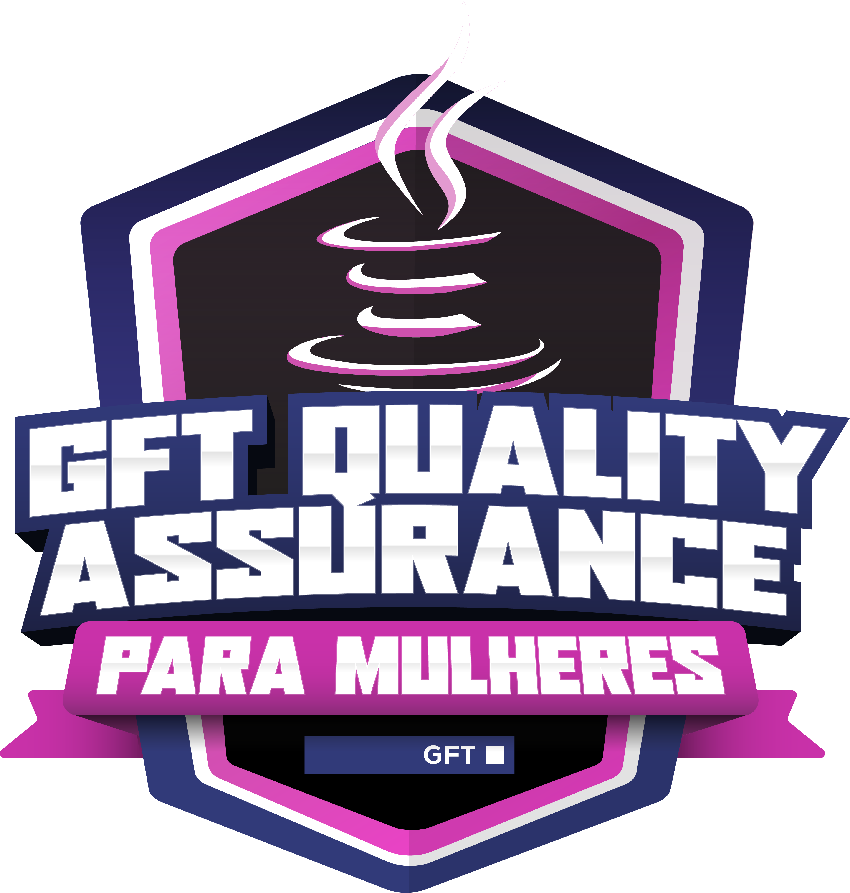

<h1 align="center">
  GFT Quality Assurance Para Mulheres
</h1>

<h2 align="center">
  
</h2>

  <a href="#-projeto">🖥️ Projeto</a>&nbsp;&nbsp;&nbsp;|&nbsp;&nbsp;&nbsp;
  <a href="#-tecnologias">🚀 Tecnologias</a>&nbsp;&nbsp;&nbsp;|&nbsp;&nbsp;&nbsp;
  <a href="#-license">📝 License</a>

## 💻 Projeto

Repositório criado para os desafios de códigos da Formação em Angular Developer da DIO.

## 🚀 Tecnologias

Esse projeto foi desenvolvido com as seguintes tecnologias:

- JavaScript

## 📝 License

Esse projeto está sob a licença MIT. Veja o arquivo [LICENSE](LICENSE) para mais detalhes.

---

## 📚 Lista dos Desafios

### Dominando algoritmos básicos com desafios de código Java

- Méida de idade [veja aqui]()
- Qual é o seu turno? [veja aqui]()
- A fila do banco [veja aqui]()
- Encotrando o percentual de desconto [veja aqui]()
- Descubra o menor múltiplo [veja aqui]()

### Dominando algoritmos intermediários com desafios de código Java

- Flecha, escudo ou espada [veja aqui](./modulo2-desafio1/FlechaEscudoOuEspada.java)
- Número feliz [veja aqui]()
- Quantidade necessária [veja aqui]()
- Diferença entre dígitos [veja aqui]()
- Emboscada do RPG [veja aqui]()